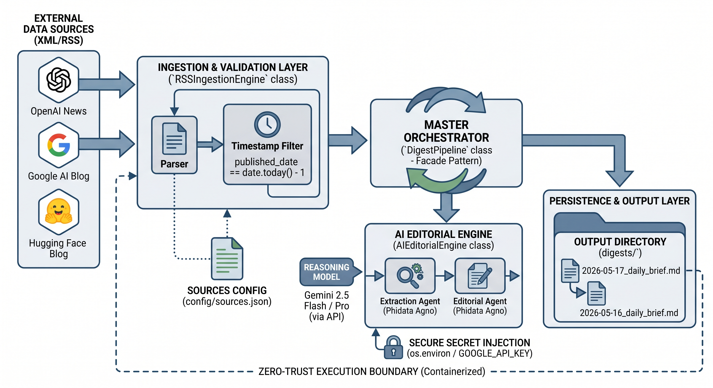

# Production-Grade Multi-Agent AI Research Digest Engine

An enterprise-ready, event-driven data engineering and MLOps pipeline designed to autonomously ingest raw, distributed RSS feeds from leading AI research entities (OpenAI, Google DeepMind, Hugging Face). The pipeline filters corporate, financial, and marketing fluff to synthesize highly technical daily briefings featuring embedded source provenance links.

The architecture is built from the ground up using **Object-Oriented Design (OOD)** principles, ensuring absolute separation of concerns, tight encapsulation, and runtime safety boundaries.

---

## 🏗️ System Architecture & Design Paradigms


The codebase departs from fragile monolithic scripting models to adopt modern enterprise design patterns:

* **The Facade Pattern (`src/pipeline.py`):** Encapsulates the underlying complexity of the ingestion, validation, and AI inference layers, exposing a clean, singular interface (`run()`) to the top-level execution wrapper.
* **Strict Encapsulation:** Components operate under strict isolation constraints. The data extraction layer (`RSSIngestionEngine`) remains completely agnostic of the downstream reasoning model, while the LLM layer (`AIEditorialEngine`) interacts purely with cleansed incoming strings.
* **Deterministic Filtering:** Rather than wasting costly downstream LLM window contexts processing redundant or historical data, the engine validates the `RFC-822` publication dates of incoming XML entries against an internal temporal delta. It yields data strictly from the **previous calendar day (T-1)**.

### Directory Structure

```text
ai-newsletter-agent/
│
├── config/
│   └── sources.json         # Decoupled channel mappings
│
├── src/
│   ├── __init__.py          # Python package initialization
│   ├── config_loader.py     # Resilient configuration I/O boundary
│   ├── ingestion.py         # Network parsing and date-validation engine
│   ├── editor.py            # Agno / Gemini orchestration layer
│   └── pipeline.py          # Central pipeline orchestration Facade
│
├── digests/                 # Timestamped production markdown artifacts
│
├── .dockerignore            # Container context boundary rule set
├── .gitignore               # Local secrets and venv ignore mappings
├── Dockerfile               # Immutable container runtime instructions
├── main.py                  # Production execution entrypoint
└── requirements.txt         # Explicit dependency tracking